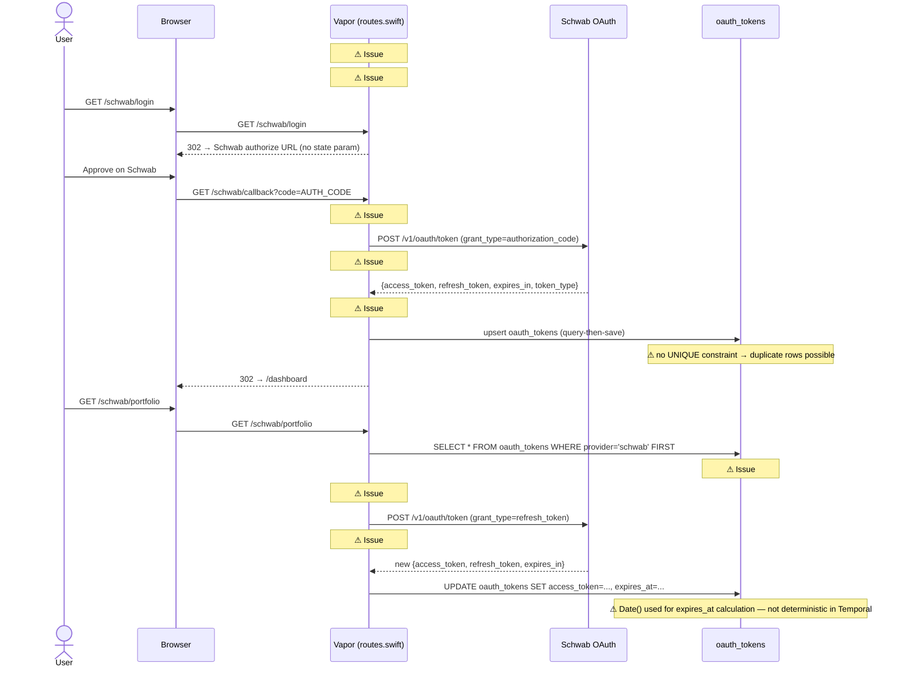
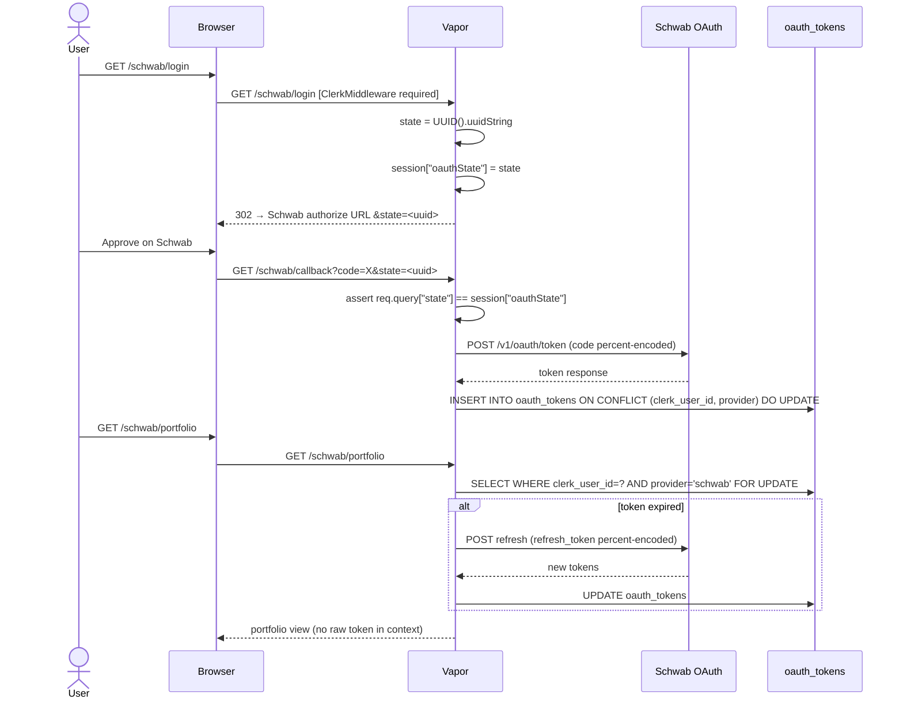
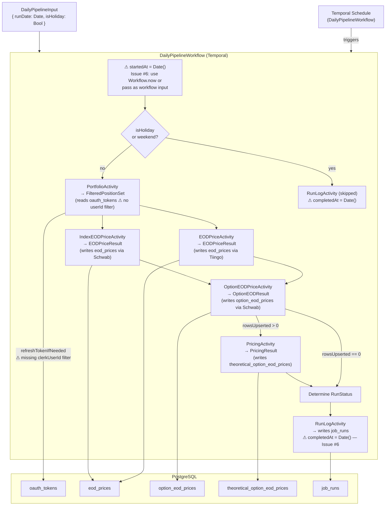
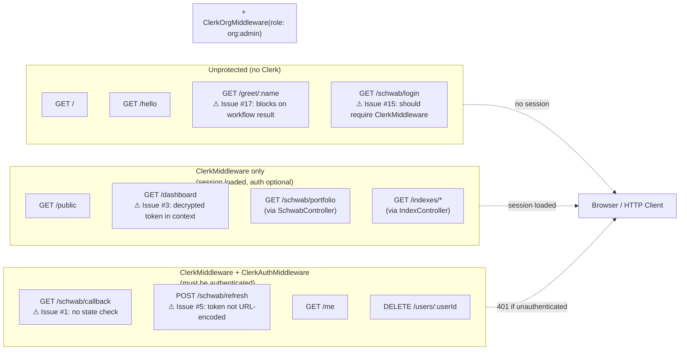
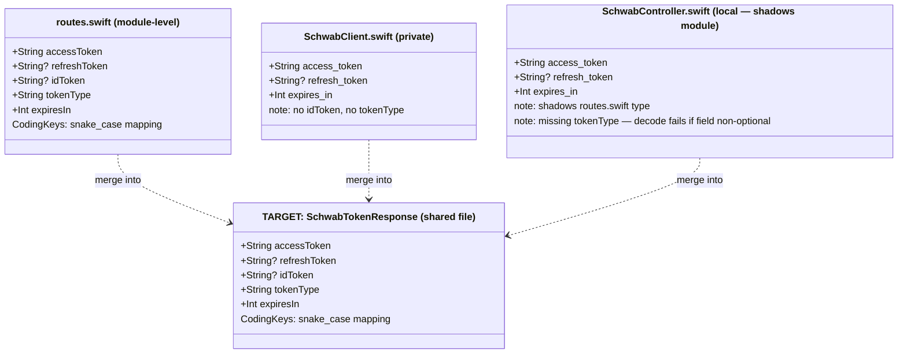
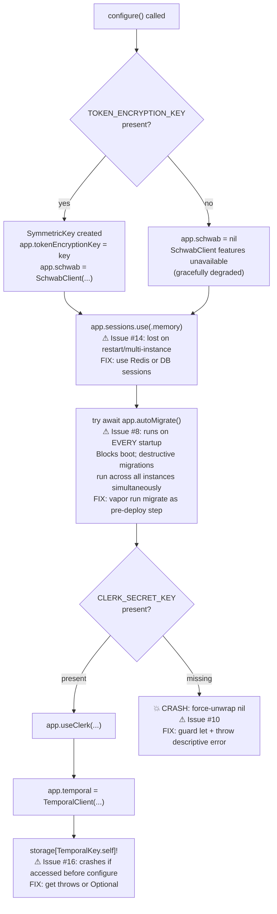
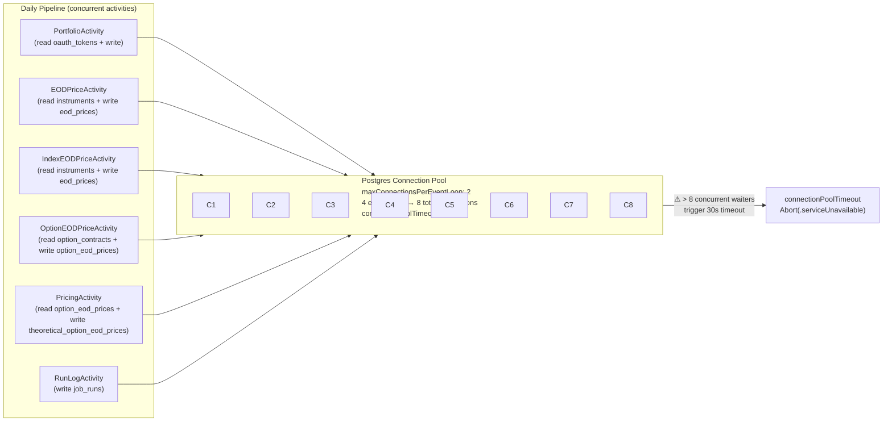

# Mid-Level ERD — Code Review Security & Reliability Hardening

> Generated 2026-03-14 from code review `Projects/002-Code_Review/Code_Review.md`
> Builds on `Code_Review-high.md`. Covers: constraints & indexes, service
> boundaries, OAuth token lifecycle, Temporal workflow data flow, route auth
> map, and the SchwabTokenResponse consolidation target.

---

## 1. Database Schema — Constraints & Indexes

This diagram extends the high-level entity map with the constraints that exist
today, the missing constraints identified by the review, and the migration
actions required.

```mermaid
erDiagram

    CURRENCIES {
        string currency_code   PK  "user-assigned; ISO 4217"
        string name            NN
    }

    EXCHANGES {
        uuid   id              PK
        string mic_code        NN  "UNIQUE — enforced by migration"
        string name            NN
        string country_code    NN
        string timezone        NN
        date   created_at
    }

    INSTRUMENTS {
        uuid   id              PK
        enum   instrument_type NN  "equity|index|equity_option|index_option"
        string ticker          NN
        string name            NN
        uuid   exchange_id     FK  "nullable → exchanges.id"
        string currency_code   FK  "NN → currencies.currency_code"
        bool   is_active       NN  "default true"
        date   created_at
    }

    EQUITIES {
        uuid   instrument_id   PK  "FK → instruments.id (1:1 subtype)"
        string isin
        string cusip
        string figi
        string sector
        string industry
        int    shares_outstanding
    }

    INDEXES {
        uuid   instrument_id   PK  "FK → instruments.id (1:1 subtype)"
        string index_family
        string methodology
        string rebalance_freq
    }

    OPTION_CONTRACTS {
        uuid   instrument_id   PK  "FK → instruments.id (1:1 subtype)"
        uuid   underlying_id   FK  "NN → instruments.id"
        enum   option_type     NN  "call|put"
        enum   exercise_style  NN  "american|european|bermudan"
        double strike_price    NN
        date   expiration_date NN
        double contract_multiplier NN  "default 100"
        string settlement_type NN  "default physical"
        string osi_symbol
    }

    EOD_PRICES {
        uuid   id              PK
        uuid   instrument_id   FK  "NN → instruments.id"
        date   price_date      NN
        double open
        double high
        double low
        double close           NN
        double adj_close
        int    volume
        double vwap
        string source
        date   created_at
    }

    OPTION_EOD_PRICES {
        uuid   id              PK
        uuid   instrument_id   FK  "NN → instruments.id"
        date   price_date      NN
        double bid
        double ask
        double last
        double settlement_price
        int    volume
        int    open_interest
        double implied_volatility
        double delta
        double gamma
        double theta
        double vega
        double rho
        double underlying_price
        double risk_free_rate
        string source
        date   created_at
    }

    THEORETICAL_OPTION_EOD_PRICES {
        uuid   id              PK
        uuid   instrument_id   FK  "NN → instruments.id"
        date   price_date      NN
        double price           NN
        double settlement_price
        double implied_volatility
        double historical_volatility NN
        double risk_free_rate  NN
        double underlying_price NN
        double delta
        double gamma
        double theta
        double vega
        double rho
        enum   model           NN  "black_scholes|binomial|monte_carlo"
        string model_detail
        string source
        date   created_at
    }

    CORPORATE_ACTIONS {
        uuid   id              PK
        uuid   instrument_id   FK  "NN → instruments.id"
        enum   action_type     NN
        date   ex_date         NN
        date   record_date
        date   pay_date
        double ratio
        string notes
        date   created_at
    }

    FRED_YIELDS {
        uuid   id              PK
        enum   series_id       NN  "DGS1MO|DGS3MO|DGS6MO|DGS1|DGS2|DGS5"
        date   observation_date NN
        double yield_percent
        double continuous_rate
        double tenor_years     NN
        string source
        date   created_at
        date   updated_at
    }

    OAUTH_TOKENS {
        uuid   id              PK
        string clerk_user_id   NN  "⚠ MISSING: UNIQUE(clerk_user_id, provider)"
        string provider        NN  "e.g. schwab"
        string access_token    NN  "AES-GCM encrypted"
        string refresh_token       "AES-GCM encrypted; nullable"
        string scope
        date   expires_at      NN
        date   created_at
        date   updated_at
    }

    JOB_RUNS {
        uuid     id              PK
        date     run_date        NN
        string   status          NN  "success|partial|failed|skipped"
        int      equities_fetched
        int      options_fetched
        int      contracts_priced
        int      theoretical_rows
        int      new_contracts
        string[] dropped_positions
        string[] failed_tickers
        string[] skipped_contracts
        uuid[]   failed_contracts
        string[] error_messages
        string   source_used
        date     started_at      NN  "⚠ set via Date() — not Workflow.now"
        date     completed_at        "⚠ set via Date() — not Workflow.now"
    }

    MARKET_HOLIDAYS {
        uuid   id              PK
        date   holiday_date    NN  "UNIQUE — enforced by migration"
        string description
        date   created_at
    }

    CURRENCIES          ||--o{ INSTRUMENTS              : "currency_code FK"
    EXCHANGES           ||--o{ INSTRUMENTS              : "exchange_id FK (nullable)"
    INSTRUMENTS         ||--o| EQUITIES                 : "instrument_id PK/FK"
    INSTRUMENTS         ||--o| INDEXES                  : "instrument_id PK/FK"
    INSTRUMENTS         ||--o| OPTION_CONTRACTS         : "instrument_id PK/FK"
    INSTRUMENTS         ||--o{ OPTION_CONTRACTS         : "underlying_id FK"
    INSTRUMENTS         ||--o{ EOD_PRICES               : "instrument_id FK"
    INSTRUMENTS         ||--o{ OPTION_EOD_PRICES        : "instrument_id FK"
    INSTRUMENTS         ||--o{ THEORETICAL_OPTION_EOD_PRICES : "instrument_id FK"
    INSTRUMENTS         ||--o{ CORPORATE_ACTIONS        : "instrument_id FK"
```

### Missing Constraints (require new migrations)

| Table | Gap | Required Action |
|---|---|---|
| `oauth_tokens` | No `UNIQUE(clerk_user_id, provider)` | Add unique index; update upsert in `/schwab/callback` to use `ON CONFLICT DO UPDATE` |
| `eod_prices` | No `UNIQUE(instrument_id, price_date)` | Upsert logic relies on query-then-insert; a unique index makes this race-safe |
| `option_eod_prices` | No `UNIQUE(instrument_id, price_date)` | Same as above |
| `theoretical_option_eod_prices` | No `UNIQUE(instrument_id, price_date, model)` | Multiple models per day are valid; model must be part of the key |
| `fred_yields` | No `UNIQUE(series_id, observation_date)` | FRED may push the same date twice; upsert needs a conflict target |

---

## 2. OAuth Token Lifecycle

Shows the current flow and where issues #1–5 manifest.



### Target State (post-fix)



---

## 3. Daily Pipeline — Temporal Workflow & Activity Data Flow

Shows how `DailyPipelineWorkflow` orchestrates activities and writes to DB,
with issue #6 (`Date()` non-determinism) annotated.



### Required Changes for Determinism (Issue #6)

`DailyPipelineInput` must carry the workflow start timestamp so activities and
the run log record a consistent, replay-safe value:

```
DailyPipelineInput {
    runDate:   Date       // existing
    isHoliday: Bool       // existing
    startedAt: Date       // NEW — set by schedule launcher, passed through
}
```

`completedAt` for the run log should be the result of a deterministic side
effect or a timestamp returned by the final activity, not `Date()` inline.

---

## 4. Route Authentication Map

Shows which middleware is applied to each route group and where gaps exist.



### Auth Gaps

| Route | Current | Required | Issue |
|---|---|---|---|
| `GET /schwab/login` | No middleware | `ClerkMiddleware + ClerkAuthMiddleware` | #15 |
| `GET /schwab/callback` | `ClerkMiddleware + ClerkAuthMiddleware` | + state param CSRF check | #1 |
| `GET /dashboard` | `ClerkMiddleware` | Remove decrypted token from Leaf context | #3 |
| `GET /greet/:name` | None | Acceptable for demo; block for production | #17 |

---

## 5. SchwabTokenResponse Consolidation

Three separate structs decode the same Schwab token endpoint response. They
must be merged into one canonical type.



The canonical type should live in a new file, e.g.
`Sources/bug-free-memory/Models/SchwabTokenResponse.swift`, and be the only
definition imported by `routes.swift`, `SchwabClient.swift`, and
`SchwabController.swift`.

---

## 6. Application Storage — Startup Crash Points

Issues #10, #16, and the `TOKEN_ENCRYPTION_KEY` lifecycle, mapped against
`configure.swift`.



---

## 7. Connection Pool vs. Pipeline Concurrency

Documents the gap between `maxConnectionsPerEventLoop: 2` (issue #19) and the
concurrent DB writes the daily pipeline issues.



**Recommendation:** Set `maxConnectionsPerEventLoop` to 4–5, giving 16–20 total
connections on a 4-core host. Benchmark under a realistic pipeline run before
finalizing.

---

## 8. Summary of Changes by Layer

| Layer | File(s) | Issues Fixed | Action |
|---|---|---|---|
| **DB Migrations** | New migration files | #2 (partial), #4 (partial), gap | Add `UNIQUE(clerk_user_id, provider)` on `oauth_tokens`; unique indexes on time-series tables |
| **Models** | `SchwabTokenResponse.swift` (new) | #7 | Consolidate three structs into one canonical type |
| **Models** | `DailyPipelineInput` | #6 | Add `startedAt: Date` field |
| **DTOs** | `InstrumentDTOs.swift` | #11 | Replace `parsedInstrumentType` force-unwrap with throwing function |
| **Services** | `SchwabClient+Portfolio.swift` | #2, #4 | Add `clerkUserId` parameter; add `SELECT FOR UPDATE` or actor serialization |
| **Services** | `SchwabClient.swift`, `routes.swift` | #5 | Percent-encode refresh token before inserting into form body |
| **Controllers** | `SchwabController.swift` | #4, #18 | Remove inline refresh logic; delegate to `SchwabClient.refreshTokenIfNeeded` |
| **Controllers** | `IndexController.swift` | #9 | Replace `unsafeRaw` filter with `.filter(\.$instrumentType == .index)` |
| **Controllers** | `InstrumentController.swift` | #13 | Decode body once; reuse decoded value |
| **Controllers** | All controllers | #12 | Replace `model.id!` with `guard let id` + `throw Abort(.internalServerError)` |
| **Routes** | `routes.swift` | #1, #3, #5, #15 | Add OAuth state; remove token from Leaf context; add ClerkMiddleware to login; percent-encode tokens |
| **Config** | `configure.swift` | #8, #10, #14, #16, #19 | Disable `autoMigrate`; guard on `CLERK_SECRET_KEY`; switch to persistent sessions; make `temporal` storage safe; raise connection pool limit |
| **Workflows** | `DailyPipelineWorkflow.swift` | #6 | Use `startedAt` from input; replace `completedAt: Date()` with deterministic timestamp |
